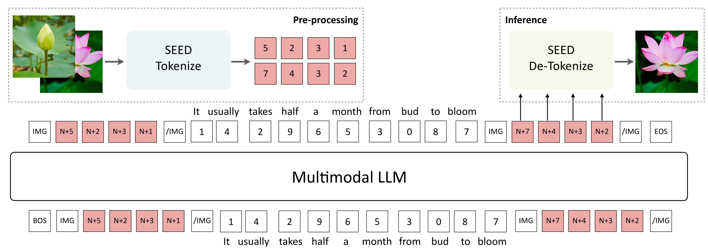
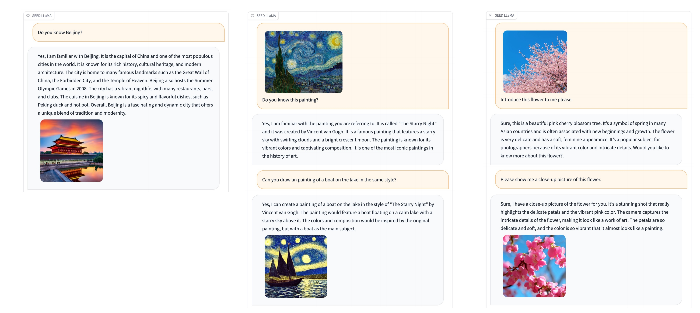
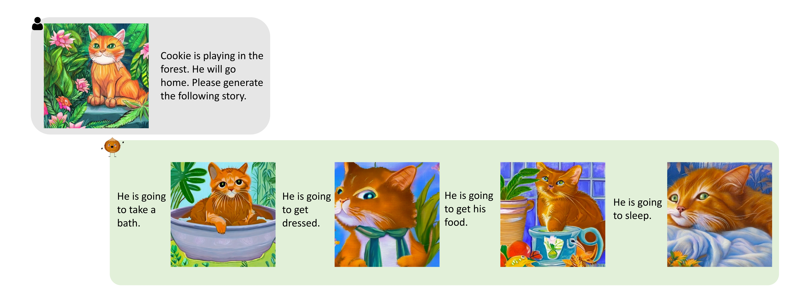

# :chestnut: SEED Multimodal

[](https://ailab-cvc.github.io/seed/)
[](https://arxiv.org/abs/2307.08041)
[](https://arxiv.org/abs/2310.01218)
[](https://huggingface.co/AILab-CVC/SEED/tree/main)
[](https://c0c18bb50ca9b78b8f.gradio.live/)


**Powered by [CV Center, Tencent AI Lab](https://ailab-cvc.github.io), and [ARC Lab, Tencent PCG](https://github.com/TencentARC).**


The repository provides the official implementation of [SEED](https://ailab-cvc.github.io/seed/seed.html), [SEED-LLaMA](https://ailab-cvc.github.io/seed/seed_llama.html). For any inquiries, please email [seed-x@googlegroups.com](mailto:seed-x@googlegroups.com).


## News

**:beers: We are actively looking for self-motivated interns. Please feel free to reach out if you are interested. :beers:**

- [x] **2024-02-24** :hugs: We have released the **training code** of SEED-LLaMa, including SEED tokenizer, Multimodal LLM pretraining and instruction tuning. Our Multimodal LLM training codebase supports 1. large-scale multi-node training with deepspeed 2. highly-efficient multiple training datapipes.
- [x] **2024-01-16** :star_struck: Our SEED-LLaMA ([arXiv](https://arxiv.org/abs/2310.01218)) has been accepted by **ICLR 2024** ([OpenReview](https://openreview.net/forum?id=0Nui91LBQS)), see you in Vienna!
- [x] **2023-11-03** :hugs: We have released the demo of [seed-llama-v2-1](https://c0c18bb50ca9b78b8f.gradio.live/), and the quality of generated images has been greatly improved, feel free to use it by yourself.

  

- [x] **2023-10-23** :hugs: We have optimized the memory overhead. Through 8bit quantization and dynamic loading, SEED-LLaMA 8b/14B can run on single **16GB/24GB** GPU.
- [x] **2023-10-23** :hugs: All model weights will be **downloaded automatically** when starting the demo.
- [x] **2023-10-20** :hugs: We release the [checkpoints](https://huggingface.co/AILab-CVC/SEED/tree/main) and code of the SEED-2 tokenizer, and SEED-LLaMA-8B/14B. 
- [x] **2023-10-20** :space_invader: We release an online [gradio demo](https://huggingface.co/spaces/AILab-CVC/SEED-LLaMA), feel free to use it by yourself.
- [x] **2023-10-02** :paperclip: We release the technical report of SEED-LLaMA on [arXiv](https://arxiv.org/abs/2310.01218), which is empowered by the improved SEED-2 tokenizer.
- [x] **2023-07-29** :octocat: We release the checkpoint of the SEED tokenizer and its inference code. Check it out via [SEED-1](./SEED-1.md).
- [x] **2023-07-16** :paperclip: We release the technical report of SEED on [arXiv](https://arxiv.org/abs/2307.08041).

Stay tuned for the updates!

## Brief Introduction

It is recommended to check out our [papers](#citation) for technical details.

### :speech_balloon: What can SEED-LLaMA do?


**SEED-LLaMA** is capable of both multimodal comprehension and generation, exhibiting compositional emergent abilities such as multi-turn in-context multimodal generation, acting like your AI assistant. [[Compare to SOTA]](https://ailab-cvc.github.io/seed/seed_llama_compare.html) [[More examples on X]](https://twitter.com/ge_yixiao/status/1710509538238157069?s=20)

<!-- We present **SEED-LLaMA** by large-scale pretraining and instruction tuning on the interleaved textual and visual data, which demonstrates impressive performance on a broad range of multimodal comprehension and generation tasks. More importantly, SEED-LLaMA has exhibited **compositional emergent abilities** such as multi-turn in-context multimodal generation, acting like your **AI assistant**. -->

### :bulb: How does SEED-LLaMA achieve it?


The core of SEED-LLaMA is the tailored **SEED** tokenizer, which properly quantized visual signals into discrete visual tokens, capturing necessary semantics while being produced under 1D causal dependence. [[SEED-2 vs. SEED-1]](https://ailab-cvc.github.io/seed/seed_llama.html)

<!-- ### Compositional Emergent Ability
**Multi-turn in-context image and text generation.**


**Compositional image generation.**
 -->

<!-- ### SEED Tokenizer v2
In SEED tokenizer v2, the generation embedding is aligned with the **image embedding** (1 token) of [unCLIP SD](https://huggingface.co/stabilityai/stable-diffusion-2-1-unclip), and can be decoded to realistic images with the unCLIP-SD-UNet. In SEED tokenizer v1, we train a visual tokenizer through aligning the **generation embeddings** with the text embeddings (77 tokens) of [SD](https://github.com/CompVis/stable-diffusion), and the generation embeddings can be decoded to images with the SD-UNet. The below figure shows the visual comparison of the reconstructed images between SEED tokenizer v2 (the third row) and SEED tokenizer v1 (the second row). We can observe that the images reconstructed by SEED tokenizer v2 can better preserve the visual information of the original images. The semantic representations of texts can not fully preserve the rich visual information of images.
 -->

<!-- ### Pretraining
We perform multimodal autoregressive pretraining on interleaved visual and textual data for SEED-LLaMA. Visual inputs are pre-processed into discrete tokens to conserve computational resources. Given the multimodal discrete sequence, a unified next-word-prediction objective is employed. During inference, visual codes are decoded into a realistic image by SEED De-Tokenization.
 -->

## Hightlights
1. We use GPT-4 to rewrite the instructions in the [InstructPix2Pix dataset](https://arxiv.org/abs/2211.09800), such as transforming "add a storm" into "Can you add a storm effect to the image?" and responding with "Sure, I have successfully added a storm effect to the image.". The instruction tuned model can **generate informative text and images in a single response**, as shown in the figure below (this is also an **emergent ability**).


2. Given a starting image and story, the instruction tuned model can **generate the following story and multiple images** in one go.


3. We use GPT-4 to generate instruction based on the text content of [MMC4](https://arxiv.org/abs/2304.06939). The instruction tuned model can **generate image-text interleaved content** (Our released sft model does not possess this feature as we  separately instruction tune the pre-trained model on MMC4).


## Usage

### Dependencies
- Python >= 3.8 (Recommend to use [Anaconda](https://www.anaconda.com/download/#linux))
- [PyTorch >= 1.11.0](https://pytorch.org/)
- NVIDIA GPU + [CUDA](https://developer.nvidia.com/cuda-downloads)

### Installation
Clone the repo and install dependent packages

  ```bash
  git clone https://github.com/AILab-CVC/SEED.git
  cd SEED
  pip install -r requirements.txt
  ```

    
### Model Weights
We release the pretrained SEED Tokenizer and De-Tokenizer, pretrained and instruction tuned SEED-LLaMA-8B and SEED-LLaMA-14B in [SEED Hugging Face](https://huggingface.co/AILab-CVC/SEED).

- Check the SEED tokenizer weights in [AILab-CVC/seed-tokenizer-2](https://huggingface.co/AILab-CVC/seed-tokenizer-2)
- Check the SEED LLaMA(8B) weights in [AILab-CVC/seed-llama-8b-sft](https://huggingface.co/AILab-CVC/seed-llama-8b-sft)
- Check the SEED LLaMA(14B) weights in [AILab-CVC/seed-llama-14b-sft](https://huggingface.co/AILab-CVC/seed-llama-14b-sft)

<!-- Please download the checkpoints and save under the folder `./pretrained`.

```bash
cd pretrained   # SEED/pretrained
git lfs install
git clone https://huggingface.co/AILab-CVC/SEED
mv SEED/* ./
``` -->

The model weights of unCLIP SD-UNet which are used to reconstruct the image will be downloaded automatically.

<!-- To reconstruct the image from the SEED visual codes using unCLIP SD-UNet, please download the pretrained [unCLIP SD](https://huggingface.co/stabilityai/stable-diffusion-2-1-unclip).  -->

<!-- To reconstruct the image from the SEED visual codes using unCLIP SD-UNet, please download the pretrained [unCLIP SD](https://huggingface.co/stabilityai/stable-diffusion-2-1-unclip).
Rename the checkpoint directory to **"diffusion_model"** and create a soft link to the "pretrained/seed_tokenizer" directory.

```bash
# SEED/pretrained
git lfs install
git clone https://huggingface.co/stabilityai/stable-diffusion-2-1-unclip
mv stable-diffusion-2-1-unclip seed_tokenizer/diffusion_model
``` -->


### Inference for visual tokenization and de-tokenization
To discretize an image to 1D visual codes with causal dependency, and reconstruct the image from the visual codes using the off-the-shelf unCLIP SD-UNet:

```bash
cd ..   # SEED/ 
python scripts/seed_tokenizer_inference.py
```
### Inference for SEED-LLaMA
Given that SEED-LLaMA-8B is based on Vicuna-7B and SEED-LLaMA-14B based on LLaMA2-Chat-13B, we use Vicuna-7B's ("USER:", "ASSISTANT:") and LLaMA2-Chat-13B's ([INST] [/INST]) prompts for respective instruction tuning.

```bash
# Inference for SEED-LLaMA-8B
python scripts/seed_llama_inference_8B.py
```

```bash
# Inference for SEED-LLaMA-14B
python scripts/seed_llama_inference_14B.py
```


### Launching Gradio Demo of SEED-LLaMA-14B Locally 
1. Building the local demo of SEED-LLaMA-14B currently requires **single 24GB** GPU.

```bash
# SEED/
# in first terminal
bash scripts/start_backend_14b.sh
# in second terminal
bash scripts/start_frontend_14b.sh
``` 

2. Building the local demo of SEED-LLaMA-8B currently requires **single 16GB** GPU.

```bash
# SEED/
# in first terminal
bash scripts/start_backend_8b.sh
# in second terminal
bash scripts/start_frontend_8b.sh
``` 

Then the demo can be accessed through http://127.0.0.1:80

## Training SEED-LLaMA
### Training SEED Tokenization based on [LAVIS](https://github.com/salesforce/LAVIS)
1. Installation
```bash
cd SEED/SEED_Tokenizer
sh install.sh
``` 

2. Download pre-trained Q-Former from [BLIP-2](https://storage.googleapis.com/sfr-vision-language-research/LAVIS/models/BLIP2/blip2_pretrained.pth) and put the checkpoint under the folder "pretrained".

3. Training Causal Q-Former

```bash
sh train_scripts/causal_qformer.sh
``` 

4. Download [CLIP](https://huggingface.co/laion/CLIP-ViT-H-14-laion2B-s32B-b79K) for unCLIP-SD and put the checkpoint under the folder "pretrained".

5. Training SEED Tokenizer and De-Tokenizer
```bash
sh train_scripts/codebook.sh
``` 
6. After training, you can tokenize an image into discrete tokens and decode the discrete tokens into a realistic image via [unclip SD](https://huggingface.co/stabilityai/stable-diffusion-2-1-unclip) 
```bash
# You need to load the pre-trained ckpt.
python3 eval/seed_inference.py
``` 
   
### Multimodal LLM Pre-training and instruction truning
1. Installation
```bash
cd SEED
pip install -r requirements.txt
cd MultiModalLLM
``` 

2. Download the pre-trained LLM (for example, vicuna-7b-v1.1) and [SEED Tokenizer](https://huggingface.co/AILab-CVC/seed-tokenizer-2/tree/main), and put them under the folder "pretrained".

3. Pre-process the pre-training data by converting images into discrete tokens. For example,
```bash
python3 src/tools/extract_image_ids_to_torchdata_parallel.py \
  --tokenizer configs/tokenizer/seed_llama_tokenizer.yaml \
  --image_transform configs/processer/blip_transform.yaml \
  --data configs/data/caption_torchdata_preprocess.yaml \
  --save_dir dataset/seed_llama/caption/unsplash_cc3m/ \
  --batch_size 1024 --num_workers 8 --gpus 8
``` 

4. Pre-training Multimodal LLM with SEED tokens using lora.
```bash
sh scripts/train_a100_lora_multi_node_pretrain.sh
``` 

5. Merge the lora checkpoint with the original LLM.
```bash
python3 src/tools/merge_lora_weights.py \
  --model_cfg configs/model/vicuna_7b_lora_pretrained.yaml \
  --tokenizer_cfg configs/tokenizer/seed_llama_tokenizer.yaml \ 
  --base_model pretrained/vicuna-7b-v1.1 \
  --lora_model log/seed_vicuna-7b_lora_pretrain/checkpoint-10000 \
  --save_path log/seed_vicuna-7b_lora_pretrain/checkpoint-merged-10000 
``` 

6. Pre-process the instruction tuning data by converting images into discrete tokens. For example,
```bash
python3 src/tools/extract_image_ids_to_torchdata_parallel_qa.py \
  --tokenizer configs/tokenizer/seed_llama_tokenizer.yaml \
  --image_transform configs/processer/blip_transform.yaml \
  --data configs/data/question_answer_torchdata_eval.yaml \
  --save_dir  data/VQAv2 \
  --batch_size 512 --num_workers 8 --gpus 8
``` 

7. Instruction tuning Multimodal LLM with SEED tokens using lora.
```bash
sh scripts/train_a100_lora_multi_node_sft.sh
```

## Citation
If you find the work helpful, please consider citing:
```bash
@article{ge2023making,
  title={Making LLaMA SEE and Draw with SEED Tokenizer},
  author={Ge, Yuying and Zhao, Sijie and Zeng, Ziyun and Ge, Yixiao and Li, Chen and Wang, Xintao and Shan, Ying},
  journal={arXiv preprint arXiv:2310.01218},
  year={2023}
}

@article{ge2023planting,
  title={Planting a seed of vision in large language model},
  author={Ge, Yuying and Ge, Yixiao and Zeng, Ziyun and Wang, Xintao and Shan, Ying},
  journal={arXiv preprint arXiv:2307.08041},
  year={2023}
}
```

The project is still in progress.

## License
`SEED` is released under [Apache License Version 2.0](License.txt). 

`SEED-LLaMA` is released under the original [License](https://ai.meta.com/resources/models-and-libraries/llama-downloads/) of [LLaMA2](https://huggingface.co/meta-llama/Llama-2-13b-chat-hf).

## Acknowledgement
We thank the great work from [unCLIP SD](https://huggingface.co/stabilityai/stable-diffusion-2-1-unclip) and [BLIP2](https://github.com/salesforce/LAVIS).

