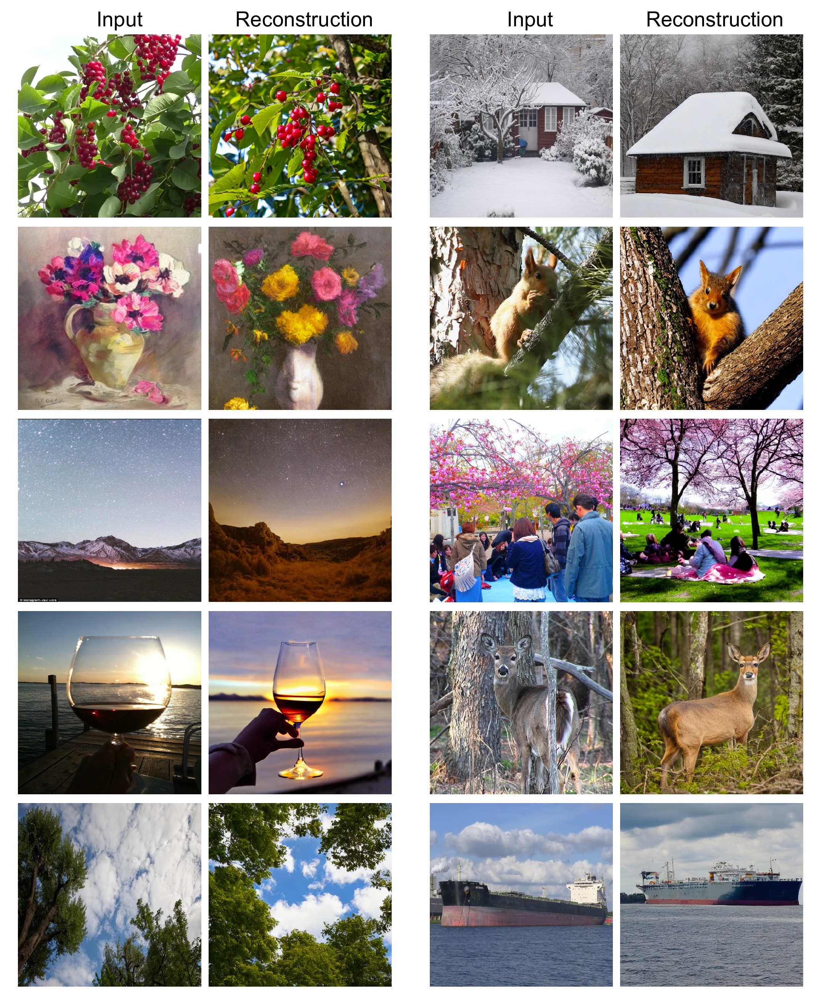
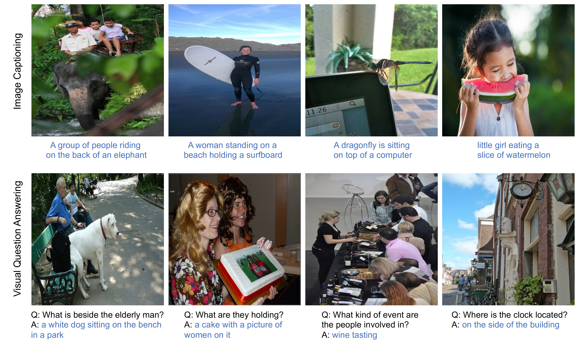

# SEED Tokenizer v1
[[arXiv]](https://arxiv.org/abs/2307.08041)


## Abstract
We present SEED, an elaborate image tokenizer that empowers Large Language
Models (LLMs) with the emergent ability to **SEE** and **D**raw at the same time.
Research on image tokenizers has previously reached an impasse, as frameworks
employing quantized visual tokens have lost prominence due to subpar performance and convergence in multimodal comprehension (compared to BLIP-2, etc.)
or generation (compared to Stable Diffusion, etc.). Despite the limitations, we
remain confident in its natural capacity to unify visual and textual representations,
facilitating scalable multimodal training with LLM’s original recipe. In this study,
we identify two crucial principles for the architecture and training of SEED that
effectively ease subsequent alignment with LLMs. (1) Image tokens should be
independent of 2D physical patch positions and instead be produced with a 1D
causal dependency, exhibiting intrinsic interdependence that aligns with the left-to-right autoregressive prediction mechanism in LLMs. (2) Image tokens should
capture high-level semantics consistent with the degree of semantic abstraction in
words, and be optimized for both discriminativeness and reconstruction during the
tokenizer training phase. As a result, the off-the-shelf LLM is able to perform both
image-to-text and text-to-image generation by incorporating our SEED through
efficient LoRA tuning. Comprehensive multimodal pretraining and instruction
tuning, which may yield improved results, are reserved for future investigation.
This version of SEED was trained in 5.7 days using only 64 V100 GPUs and 5M
publicly available image-text pairs. Our preliminary study emphasizes the great
potential of discrete visual tokens in versatile multimodal LLMs and the importance
of proper image tokenizers in broader research.

## SEED Tokenizer for Image Reconstruction


## SEED-OPT<sub>2.7B </sub> for Multimodal Comprehension


## SEED-OPT<sub>2.7B </sub> for Multimodal Generation


## Dependencies and Installation
- Python >= 3.8 (Recommend to use [Anaconda](https://www.anaconda.com/download/#linux))
- [PyTorch >= 1.11.0](https://pytorch.org/)
- NVIDIA GPU + [CUDA](https://developer.nvidia.com/cuda-downloads)
### Installation
1. Clone repo

    ```bash
    git clone https://github.com/AILab-CVC/SEED.git
    cd SEED
    ```

2. Install dependent packages

    ```bash
    sh install.sh
    ```

## Model Weights
We release the pre-trained SEED Visual Tokenizer in [google drive](https://drive.google.com/drive/folders/1xmVXuttQfBPBOe4ZR96Wu1X34uzPkxsS?usp=drive_link).

## Inference
To discretize an image to 1D vision codes with causal dependency, and reconstruct the image
from the vision codes using stable diffusion UNet,

1. Download the pre-trained SEED Visual Tokenizer and stable diffusion model in [google drive](https://drive.google.com/drive/folders/1xmVXuttQfBPBOe4ZR96Wu1X34uzPkxsS?usp=drive_link) and put them under the folder "pretrained".
2. run the inference code.
```bash
    python demo_recon.py
  ```

## To Do
- [x] Release SEED Tokenizer

## License
SEED is released under Apache License Version 2.0.

## Acknowledgement
We utilize Stable Diffusion to decode images from our visual codes, and use its implementation and pre-trained model in https://github.com/CompVis/stable-diffusion.git.

Our code is based on the implementation of BLIP-2 in https://github.com/salesforce/LAVIS.git.


## Citation
If you find the work helpful, please consider citing:
```
@misc{ge2023planting,
      title={Planting a SEED of Vision in Large Language Model},
      author={Yuying Ge and Yixiao Ge and Ziyun Zeng and Xintao Wang and Ying Shan},
      year={2023},
      eprint={2307.08041},
      archivePrefix={arXiv},
      primaryClass={cs.CV}
}
```

The project is still in progress. Stay tuned for more updates!
